# microservices_architecture

When we know the exact requirements e.g. a school that takes 500 people and is consistent with this: monolith is the best approach. easy to code, deploy, 

"we are planning to open 5 branches in the next 2 years" so an original 500 ppeople use case goes up to 3k. can we refactor the monolith that easily? - maybe not. then microservices architecture could be good. it will require multiple teams, will cost more, not easy to manage BUT is highly scalable.

ebay uses 500,000 microservices - imagine trying to manage them

Microservice - as long as we have an endpoint we can ping (docker gives an id) it is a microservice

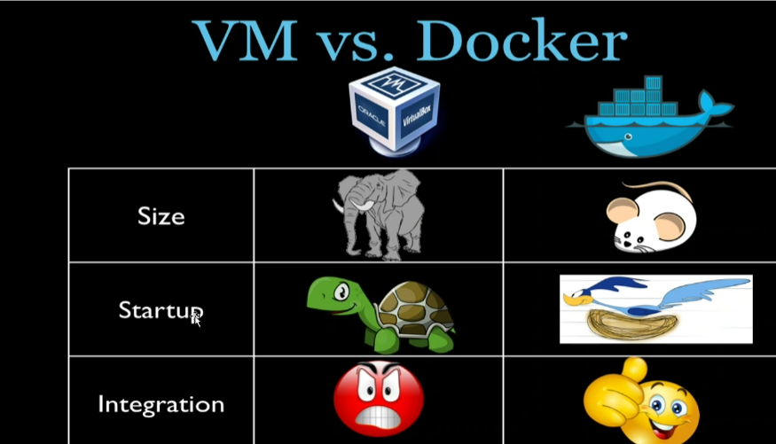

## using docker 

`docker pull` is basically `git clone`

`docker run` basically pulls then runs the image as a container

`docker run hello-world`

hello-world is a globally available package

`docker run hello-world:v6`
`docker run hello-world:latest` (same as first)

## how does docker work

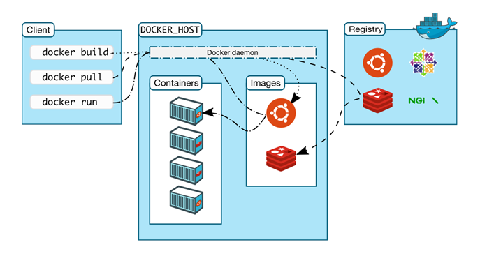

docker client: us (localhost)
run a command e.g. docker run...
this spawns a docker daemon under DOCKER_HOST
it looks for images locally -> if yes, create conmtainer
if no -> look in the registry for an image with that name and download it, then create container
if still no -> may need correct name, permissions, login,...

```
docker images
```
Lists all images downloaded locally

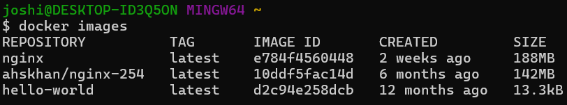


```
docker run -d -p 80:80 nginx 
```
-d : run in background
-p : specify port to run under

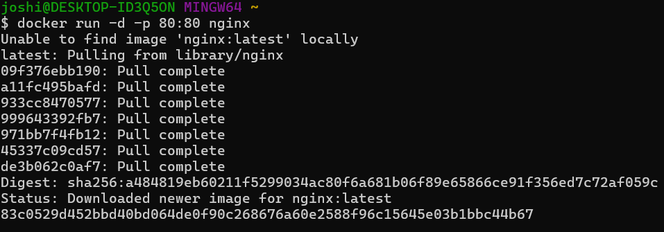

(will have to allow through firewall)

```
docker ps
```
Lists all containers running
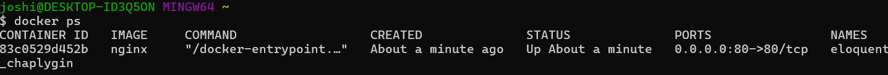

```
docker stop <id>
docker start <id>
```

```
docker ps -a
```
Lists all containers that have ran on the local machine

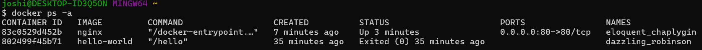

```
docker exec -it <id> sh
```

Will attempt to ssh into the container

If you see this error:
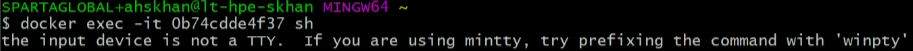

Add this environment variable then try again:

```
alias docker="winpty docker"
```

Ideally save it so it loads on startup

We are now in the container. it is a fresh instance, and does not even have sudo installed.
to install run apt-get update then upgrade, then we can run apt-get install sudo. 

Lets say we want to configure nginx:

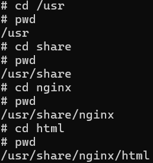

If we want to edit an image, try using nano?: it is not even installed. we need to install it.

If we edit index.html and save it, we can refresh the page and the changes will be made automatically - no need to restart the serivce.
docker is basically a live development environment. 

If we want to run a similar container to one already running (e.g. two different nginx webpages), we have to use a port mapping:
```
docker run -d -p 90:80 nginx2
```
90 on localhost, 80 on container. We access it by going to localhost:90.

you can type `bash` to get a more similar linux environment to what we're used to:

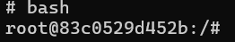

This allows for tab autocompletion etc.

```
docker rm containerid
```
Removes docker container

```
docker rmi imageid
```
Removes docker image

## creating a docker image

Firstly I created a sample index.html static webpage on my local host

Then I copied the index.html to my docker container:

```
docker cp file containerid:path/to/save
docker cp index.html 83c0529d452b:/usr/share/nginx/html/
```
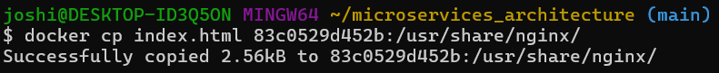

Now when we go to localhost the default webpage is the one I made:

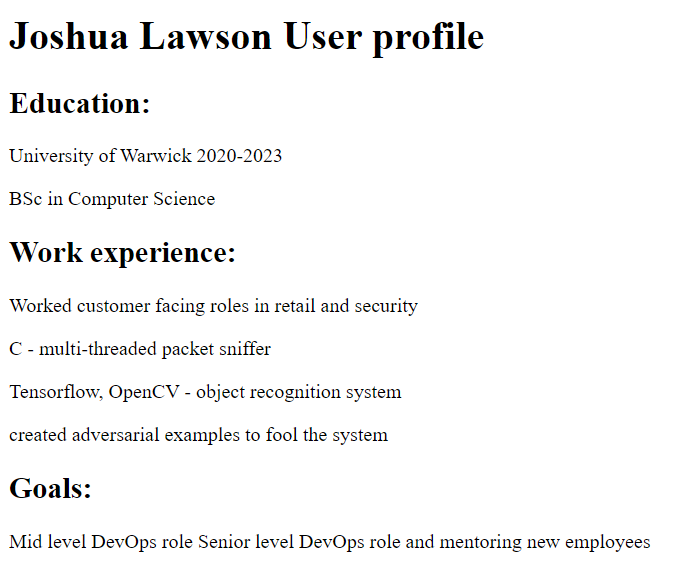

Now I have to save and commit the changes (to a new image):

```
docker commit containerid
docker commit 83c0529d452b
```

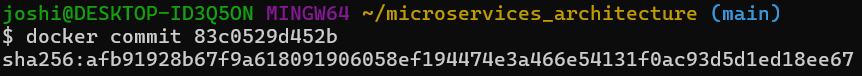

Now tag the image

```
docker images -a
docker tag your-image-name your-username/your-repository:tag
```
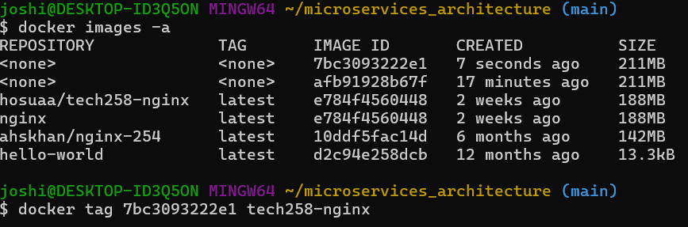

Now push the container to DockerHub - ensure you have an account and a public repo for the image. first sign in through the cli:

```
docker -u username
```
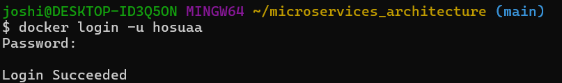


Finally push the container to your dockerhub repo:

```
docker push your-username/your-repository:tag
```
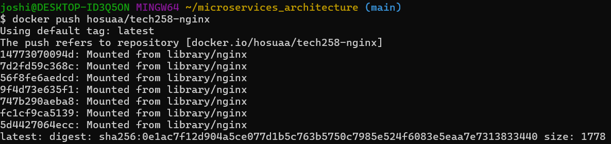

We didnt give the container a tag on dockerhub, so it will be called latest

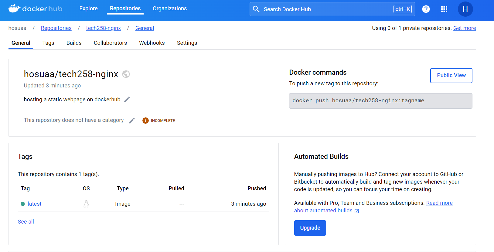

Now we can pull the image and load it up like any other:

```
docker pull your-username/your-repository:tag
```
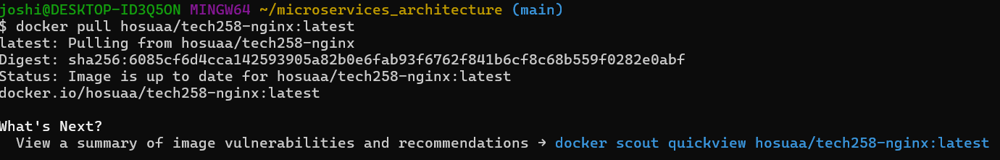

Then run as usual:

```
docker run -d -p 80:80 hosuaa/tech258-nginx:latest
```

## troubleshooting

```
docker logs containerid
```

## volume

Think of a usb flash drive. we can store stuff, take it out of the computer, put it in  another and its still there

Could use as a centralised database

`docker run... -v` : allocates space for the volume on your hard drive. e.g. 1gb depending on needs of the business

We could assign all our microservices to our volume

volumes are never created locally -> always on cloud

volume -> persistent volume -> persistent volume claim

# Kubernates/ K8 

K8 because 8 characters - means "pilot" in greek

Allows you to compose multiple microservices

Kubernates takes care of scaling and failover for your application, provides deployment patterns etc:
- Service discovery and load balancing
- Storage orchestration
- Automated rollouts and rollbacks
- Automatic bin packing
- Self-healing (high availability)
- Secret and configuration management
- Batch execution
- Horizontal scaling
- IPv4/IPv6 dual-stack
(highly available, scalable, fault tolerant)

Enable through docker settings: WARNING will use alot of ram on startup, so close all other applications while its loading

When checking docker ps now, there are lots of k8 containers

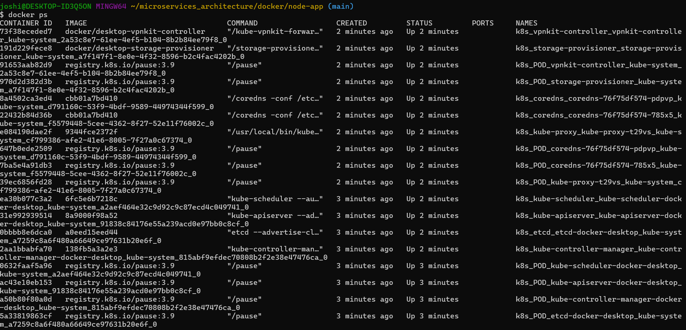

Run kubectl to check it is now installed

```
kubectl get service
or kubectl get svc
```

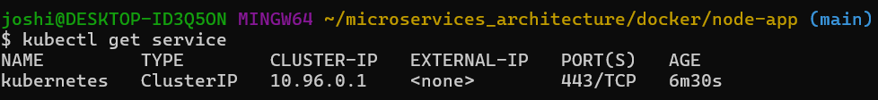

If an error appears, reset the k8 cluster (in docker settings) or restart your pc

## K8 cluster

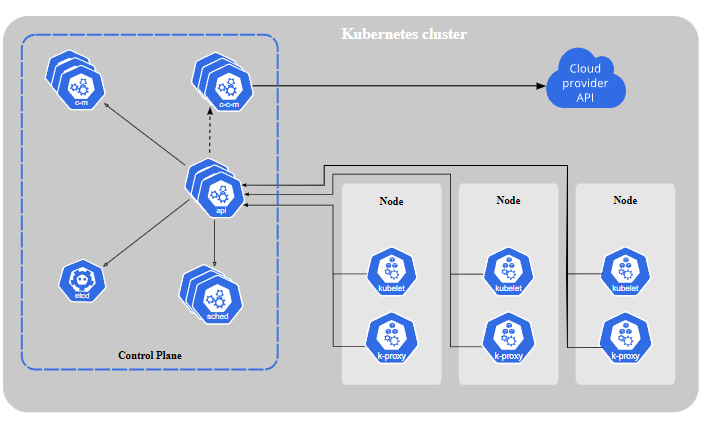

A Kubernetes cluster consists of a set of worker machines, called nodes, that run containerized applications. Every cluster has at least one worker node.

The worker node(s) host the Pods that are the components of the application workload. The control plane manages the worker nodes and the Pods in the cluster. In production environments, the control plane usually runs across multiple computers and a cluster usually runs multiple nodes, providing fault-tolerance and high availability.

Each node in a Kubernetes cluster runs the containers that form the Pods assigned to that node. Containers in a Pod are co-located and co-scheduled to run on the same node.

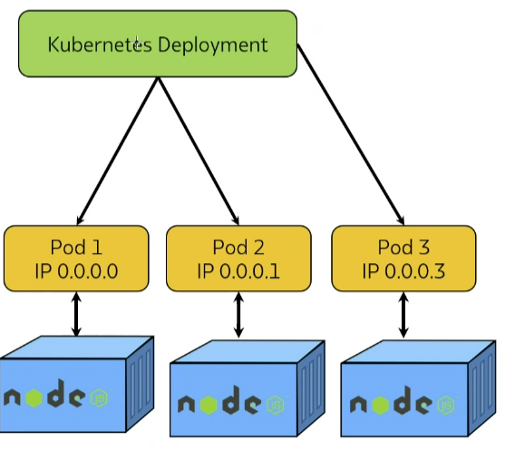

However, to make life considerably easier, you don't need to manage each Pod directly. Instead, you can use workload resources that manage a set of pods on your behalf. These resources configure controllers that make sure the right number of the right kind of pod are running, to match the state you specified.


### API server

The core of Kubernetes' control plane is the API server. The API server exposes an HTTP API that lets end users, different parts of your cluster, and external components communicate with one another - interacted with `kubectl`

### K8 object

A Kubernetes object is a "record of intent"--once you create the object, the Kubernetes system will constantly work to ensure that object exists. By creating an object, you're effectively telling the Kubernetes system what you want your cluster's workload to look like; this is your cluster's desired state.

For example, if our desired state has 3 pods we try and delete a pod through the CLI, Kubernetes will automatically start up the pod again to bring it back to 3 pods. 

Expressed in `.yaml`
Set as `spec` and `status` nested objects:
- Spec is the desired state of the object
- Status is the current state of the object

Needs:
- apiVersion
- kind
- metadata
- spec


E.g.

```
apiVersion: apps/v1
kind: Deployment
metadata:
  name: nginx-deployment
spec:
  selector:
    matchLabels:
      app: nginx
  replicas: 2 # tells deployment to run 2 pods matching the template
  template:
    metadata:
      labels:
        app: nginx
    spec:
      containers:
      - name: nginx
        image: nginx:1.14.2
        ports:
        - containerPort: 80

```

Then we can do `kubectl apply -f obj.yaml` to deploy it

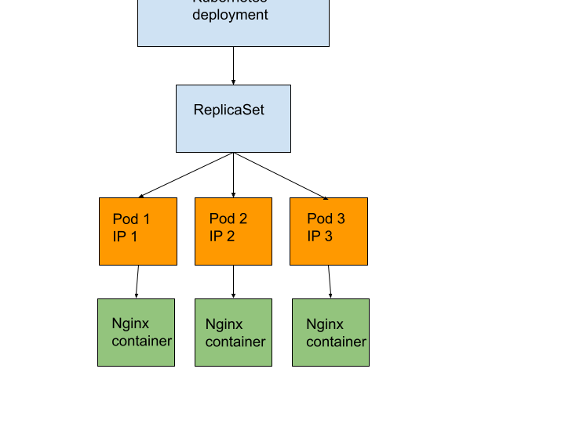

### Names

Each object in your cluster has a Name that is unique for that type of resource e.g. Deployment, Pod, Service. It is specified at `kind` in the `.yml` file. Every Kubernetes object also has a UID that is unique across your whole cluster.

You can only have one Pod named myapp-1234 within the same namespace e.g. Development, Staging, Production..., but you can have one Pod, Deployment, Service that are each named myapp-1234
- Use labels for non unique user attributes

### Labels and selectors

Labels are key/value pairs that are attached to objects such as Pods.

Labels are intended to be used to specify identifying attributes of objects that are meaningful and relevant to users, but do not directly imply semantics to the core system. Labels can be used to organize and to select subsets of objects. Labels can be attached to objects at creation time and subsequently added and modified at any time. Each object can have a set of key/value labels defined. Each Key must be unique for a given object.

Labels do not provide uniqueness. In general, we expect many objects to carry the same label(s).
- We can use a selector to identify a set of objects

VERY IMPORTANT how do we manage the k8 cluster? LABELS AND SELECTORS

## Service

When we create our K8 cluster e.g.:
```
kubectl create -f nodejs-deploy.yml`
```

We can check their status of our cluster with a few commands:

To get the status of the deploy cluster
```
kubectl get deploy
```
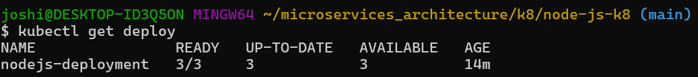

To get the status of the pods:
```
kubectl get pods
```
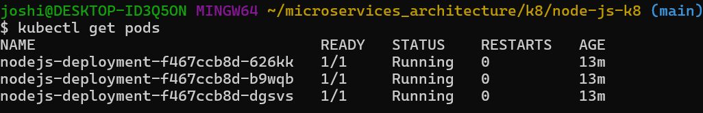

However, we will still not be able to access the pod. This is because we have not set up the service to expose the pods. Services can be of different types, such as ClusterIP, NodePort, or LoadBalancer, depending on how you want to expose your application. We used NodePort to expose our nodejs app on port 30001.
- ClusterIP: Accessible only within the cluster.
- NodePort: Exposes the service on a static port on each Node’s IP.
- LoadBalancer: Provision a load balancer for the service (useful for cloud environments).

To get the status of the service deployment:
```
kubectl get service
or kubectl get svc
```
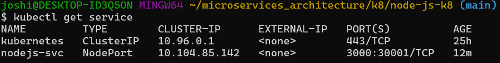

With this, we can now go to localhost:30001 and see our sparta test app working. 

## With the database

Now we can integrate the database to have our 2-tiered architecture deployed with Kubernetes.

First get the correct mongo image from Docker Hub (3.2.20)

```
docker pull mongo:3.2.20
```

I then ran the image as a container (`docker run -d mongo:3.2.20`) in the background and went into it with `docker exec -it containerid sh`

Now we need to simply edit the mongod.conf file to have the bind ip set to 0.0.0.0:
- In the mongo image, in /etc/ there is a mongod.conf.orig
- I copied the file to my local machine, and edited the line
- Finally I copied it back to the original image: `docker cp mongod.conf.orig containerid:/etc/`

Then I saved the editied container as an image to my docker hub, so I could reference it in my mongo deploy script.

I also had to create a mongo service.

With the mongo service, I could add the environment variable for DB_HOST in the app deploy script, referencing the mongo service to get its IP.

We can combine the deploy scripts into one script, splitting them up with `---` so when we create the object it creates them one after the other: (see `app-deploy.yml`)
```
volume -> mongo -> mongo svc -> db autoscaler -> app -> app svc -> autoscaler
```

You will have to seed one of the app pods so that the database is seeded (issue with mongo 3.2.20 and node 12):
```
kubectl exec pod-name  env node seeds/seed.js
```
We could run this in the node deploy script:

Bash commands in kubernetes:
```
command:
- #!/bin/bash
- echo "this is a bash command"
```